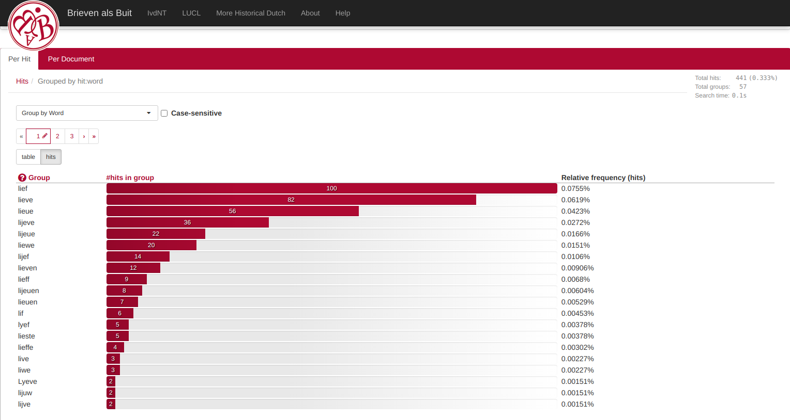
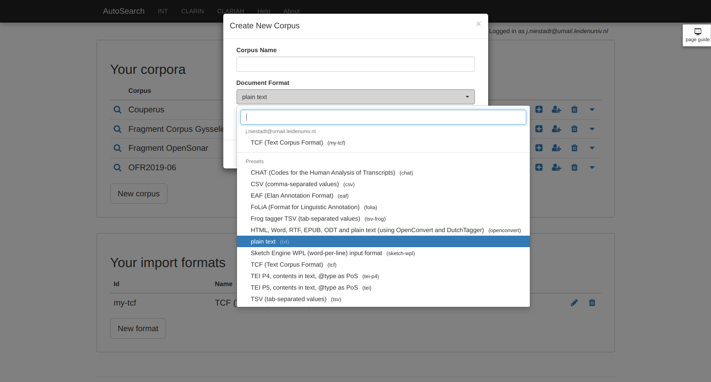

class: title
.box[

# Corpus search with BlackLab

**[bit.ly/blacklab-pres](https://inl.github.io/blacklab-presentation/)** 
**[github.com/INL/BlackLab](https://github.com/INL/BlackLab)**  
Jan Niestadt 
BlackLab developer
]

---
# What is it for?
<u>Searching</u> and <u>analyzing</u> <u>large collections</u> of <u>annotated</u>, <u>structured</u> text

---

# What is it for? Let's unpack that...

<u>Searching</u> and <u>analyzing</u> <u>large collections</u> of <u>annotated</u>, <u>structured</u> text

- <u>annotated</u>: each word can have "properties" (annotations). 
  *(e.g. lemma (headword) and part of speech)*
- <u>structured</u>: text may have hierarchical structure. 
  *(e.g. paragraph, sentence and entity markings)*
- <u>searching</u>: finding specific patterns using these annotations 
  *(e.g. noun phrases like "the quick brown fox" or "the lazy dog")*
- <u>analyzing</u>: calculating properties of matches or (sub)corpus 
  *(e.g. word frequencies per year)*
- <u>large collections</u>: our internal Corpus of Contemporary Dutch is over 2 billion tokens and growing fast

---

# Project goals

- feature-rich
- good [documentation](https://inl.github.io/BlackLab/)
- input format agnostic
- scalable, high performance
- tunable to your needs and resources
- don't reinvent the wheel (e.g. Lucene)
- welcoming to users and contributors

---

# Who uses it?

- Dutch Language Institute (INT), several historical and contemporary [corpora](https://ivdnt.org/corpora-lexica/)
- [Lexion AI](https://www.lexion.ai/), contract management system
- [In Search of the Drowned](https://lts.fortunoff.library.yale.edu/), holocaust testimonies, Yale DH Lab
- [Cosycat](https://github.com/emanjavacas/cosycat/), corpus query and annotation interface, University of Antwerp
- [IKE](https://github.com/allenai/ike), knowledge extraction, Allen Institute for Artificial Intelligence
- [EarlyPrint](https://earlyprint.org/how-to/intro_to_lingustic_search.html), early English print record, Northwestern University
- And more: [VIVA Korpusportaal](https://viva-afrikaans.org/portale/produkte-korpus/access-to-korpusportaal); [SADiLaR corpus portal](https://corpus.sadilar.org/corpusportal/search/simple); [Arabic Digital Humanities](http://arabic-dh.hum.uu.nl/corpus-frontend/about); [Fryske Akademy](https://www.fryske-akademy.nl/); [Alpheios Latin texts](https://blacklab.alpheios.net/latin-texts/search); [Spoken Hindi](http://www.cosh.site/)

---
# Can it handle my input data?

Probably yes:
- both XML and [non-XML](https://inl.github.io/BlackLab/how-to-configure-indexing.html#tabular) formats
- [several](https://inl.github.io/BlackLab/indexing-with-blacklab.html#supported-formats) supported out-of-the-box (e.g. TEI, CSV/TSV)
- add new formats using a [configuration file](https://inl.github.io/BlackLab/how-to-configure-indexing.html)
- supports non-Latin scripts
- supports text direction (LTR/RTL)

???

An important question you might be asking is: can BlackLab handle my data format? The likely answer is yes. It supports a number of common formats out of the box, and we've recently made it much easier to add support for new formats. If you have data in a format that's not supported yet, be it an XML format or a comma-separated or tab-separated file, you can write a simple configuration file to add support for your format. There's documentation on how to do this, and if you have any trouble, we'll be happy to work with you to get it sorted out.

It's also nice to know that BlackLab has no problem with special characters or different scripts; it supports all of Unicode. I've seen it used with Chechen, Chinese and Hindi corpora.

---
# What can we search for?

- annotation values
- phrases
- part of a word
- optional or repeated part of a query
- XML elements

*(examples coming up)*

---
# What can we do with the results?

- view list of matches (Key Word In Context, KWIC)
- random sample of matches
- view per document, with snippets (more like Google results)
- sort or group by document metadata
- sort or group matches by context words 
  <small>(e.g. sort by lemma before match; or group by second word in match)</small>
- capture parts of matches 
  <small>(e.g. find noun phrases, capturing adjectives and nouns separately)</small>
- word frequencies (whole corpus / per year / per medium, etc.)

*(examples coming up)*

---
# How does it work?

Put simply, BlackLab is powered by:

- Lucene's <i>reverse index</i> (like the index at the back of a book)
- Its own <i>forward index</i> (to quickly find a word at a specific position)
- A collection of custom `Query` classes to search for repetitions, XML tags, etc.

---
class: chaptertitle
# Web application (BlackLab Frontend)

---
# Web application (BlackLab Frontend)

- Full-featured corpus search application
- Used at INT for e.g. Modern Dutch Corpus
- Different levels of interface: from simple to expert
- Search part of the corpus (filter on metadata)
- Group and sort matches (including on context words)
- Upload and index your own corpora

???
Let's see what Frontend is all about. It's a web-based corpus search application, the same one we use at the INT for publishing our corpora, such as the Modern Dutch Corpus.

It features three 'difficulty levels' of search interface, so users can work with it no matter their experience. It allows filtering on metadata so you can search the part of the corpus you're interested in. It allows grouping and sorting on various properties, including contextual ones such as the text matched, or the word to the left of the match.

Fairly recently, we've added the ability to upload and index your own corpora. A very basic version of this is online now in our CLARIN portal, but we're working on a much improved version.

---

class: image, nologo
# Simple search

---

class: image, nologo
# Extended search

???
There's a simple search, for people who just want to look up a word. In this search, you don't have to know about regular expressions, but you can use the wildcards asterisk and question mark. These work the same as in file systems.

On the right, you can see the metadata interface. This adapts to the metadata in the current corpus and as you can see, it's tabbed. This corpus is based on old letters, and the first tab here shows fields related to the letter, such as the year it was sent.

The second tab shows fields related to the sender, and so on.

---

class: image, nologo
# Concordances (KWIC view)

???
If you perform a simple search on the lemma 'lief', you will get a list of concordances as a result: an overview of the keyword-in-context (also called a KWIC view).

---

class: image, nologo
# View document

???
You can click on a document title to view the document.
Here you can see the document metadata.

---

class: image, nologo
# View document

???
And here you can see the full document content. This feature is only available if the corpus metadata allows it.

---

class: image, nologo
# Group by matched word

???
If we go back to our KWIC view, you can see there's many different forms of the word 'lief': inflections and spelling variations. What if we want to know how often each occurs?

Well, we can group the result set by words matched and we will get a frequency list like this that shows us what are the more common and less common variants. We can even click on individual bars to see the group of matches it represents.

---

class: image, nologo
# Group by matched PoS

???
We can also group on a different criterium. Let's say we want to know the part of speech of the matched word. That produces this much smaller bar graph, and we can see that most of our matches are adjectives, but some are nouns as well.

Let's have a look at the different levels of search. This again is the simple search, for looking up a simple word or phrase.

---

class: image, nologo
# Advanced search: query builder

???
If you want to access more of the available features, but aren't yet comfortable with CQL, the Advanced tab brings you to the query builder interface. Here you can add tokens, add criteria to tokens, combine criteria with AND and OR, set repetitions for tokens, etc.

This query builder was inspired by the one seen in the Swedish Korp interface.

---

class: image, nologo
# Expert: enter CQL query

???
Finally, for people like me, who prefer to type in Corpus Query Language directly, there's the Expert interface. Here you can create queries as complicated as you want.

---
# Advanced search features (I)

.cql-examples[
| | |
|----------------------------------|------------------------------------------------|
| sequence of words        | "dog" "is" "happy" |
| wildcard                 | "dog" [] "hungry"  |
| match by annotation(s)   | "good" [lemma="dog" &amp; pos="noun"] |
| parts of words           | [lemma="dog.*"] |
| optional parts           | "dog" "is" "very"? "large" |
]

*([Corpus Query Language](https://inl.github.io/BlackLab/corpus-query-language.html))*

---
# Advanced search features (II)

.cql-examples[
| | |
|----------------------------------|------------------------------------------------|
| repetitions              | "a" [pos="adjective"]+ "dog" |
| OR operator              | ("big" "friendly" &#124; "small" "yappy") |
| global constraint        | A:[] "eat" B:[] :: A.lemma = B.lemma |
| XML elements             | &lt;s/&gt; containing "dog&#124;cat" |
|                          | &lt;ne type="loc"/&gt; containing "labrador" |
]

*([Corpus Query Language](https://inl.github.io/BlackLab/corpus-query-language.html))*

???
BlackLab can help you find sequences of words, where each word match may use a different annotation such as word, lemma (or head word) or part of speech. So you could look for an adjective followed by a a form of the word 'hobbit'.

You can also match parts of a word or lemma, your query can include optional parts and repetitions (such as one or more adjectives), and you can even do simple matches based on XML elements.

And finally, if you use these to match several different phrases, you can easily get a frequency list, so you get a quick overview of how often each phrase occurs. I will give some examples later.

If you want to use all these powerful pattern matching features, you will have to learn Corpus Query Language (or CQL), which is a standard in the corpus search world. It's not too difficult, especially if you're already familiar with the concept of regular expressions. Of course, you don't have to learn CQL right away if you just want to perform some simple searches. I will show you in a minute.

---

class: image, nologo
# Create your own corpus

???

Like I said before, it is possible for users to upload their own data to search. This is the easiest way to try setting up a small corpus with BlackLab.

You can upload one of the supported formats or define your own in the web application.

It should also be possible to upload plain text or Word documents and have them tagged automatically and made searchable.

---

class: image, nologo
# Create your own corpus

???
Here's the list of formats we support out-of-the-box.

---

class: image, nologo
# Create your own corpus

???
And here's the interface to create your own custom format configuration. This will require checking the documentation of course, but you can use the builtin formats as a starting point if you want.

---
class: chaptertitle
# Multiple ways to use BlackLab

---
# Multiple ways to use BlackLab

- **Web application (BlackLab Frontend)** 
  publish some corpora or allow users to upload their own
- **Webservice (BlackLab Server)** 
  accessible from any programming language
- **Java library** 
  power mere mortals were not meant to meddle with

(GitHub: [webservice/library](https://github.com/INL/BlackLab) / [frontend](https://github.com/INL/corpus-frontend))

???
Well, there's three main "flavours" or "levels" of BlackLab you could say, each of which are suited to a different group of users.

For the least-technical users, or for people who just want to quickly try something out, we have Frontend. This is a web application that can be configured as a static corpus search application, or configured to allow each user to upload their own data, which will automatically be indexed by BlackLab and be ready to search. More on this in a moment.

For computational linguists and developers who want to use BlackLab to analyze a corpus, or develop an application, there's BlackLab Server. This is a web service and can easily be used from any programming language.

Finally, if you really want full control over all of BlackLab's features, and you're comfortable in Java, there's also a Java API you can use directly.

---
# Java library (BlackLab Core)

- Clean API ([basic example](https://inl.github.io/BlackLab/getting-started.html#write-a-simple-blacklab-application))
- Finest control over features
- Might be faster or more memory-efficient in rare cases
- Available if you really need it, but most users won't

???
Let's quickly look at the Java API. It's fairly clean and there's examples of how to use it. It is based on the popular and mature text search engine Apache Lucene. It supports a few less commonly used features that are not available through the web service yet, such as capturing multiple specific parts of your query for each hit.

It's definitely the most advanced way of using BlackLab. It shouldn't be a problem for a competent developer, but it's also not usually necessary. I would recommend most people use BlackLab Server or Frontend.

---
# BlackLab Server

- RESTful webservice; speaks XML/JSON
- Use from any programming language ([examples](https://inl.github.io/BlackLab/blacklab-server-different-languages.html))
- [API documentation](https://inl.github.io/BlackLab/blacklab-server-overview.html)
- From quick scripts to complex applications
- Takes care of multi-user, caching, paging, etc.
- No problem if you've written similar scripts before

???
Let's look at BlackLab Server next. Don't worry if this is a bit too technical for your taste, I will quickly go over this and then show what you can accomplish in Frontend, which is a great place to get your feet wet and play around with the possibilities.

BlackLab Server is just a REST web service, and it can reply with either XML or JSON, whichever you prefer. Like any web service, you can use it from any programming language, for example Python or R. We use it as the basis for Frontend ourselves. It's also nice to use in a script if you want to answer some question that cannot easily be done using Frontend.

So this is already more accessible than the Java API. Anyone with a little experience in any programming language can use this. And if you do get stuck, you can always ask, I'll be happy to help if I can.

Let's look at what BlackLab Server can do for you.

---
# BlackLab Server examples 1

What corpora are available?
>`/blacklab-server/`

Information about *Brieven als Buit* (*Letters as Loot*) corpus:
>`/blacklab-server/zeebrieven/`

???
So these are probably the first thing you would ask BlackLab Server.

The first URL actually shows all the corpora available on a BlackLab Server node. The second tells you more about one of the corpora mentioned in the response to the first URL, such as what annotations are available (e.g. word, lemma, PoS) and what metadata fields (e.g. author, title, etc.)

You can either type these in the browser or fetch them from a script, of course. Frontend uses this information to generate the user interface, for example.

---
# BlackLab Server examples 2

Documents in the *Brieven als Buit* (*Letters as Loot*) corpus:
>`/bls/zeebrieven/docs/`

Filter by author:
>`/bls/zeebrieven/docs/?filter=afz_naam_norm:visser`

Find hits by lemma:
>`/bls/zeebrieven/hits/?patt=[lemma="schip"]`

???
So when you know the corpus you want to query, this is how you could proceed. The first URL here simply returns a list of all documents in the corpus, along with their metadata values. Actually, it won't return the full list, just the first page, and you can fetch subsequent pages if you want.

The second URL filters this list by author. You can filter it by any metadata field, of course.

The third shows us how to execute a CQL query. Of course, the CQL query should be URL-encoded if you're doing this, but that would make for an ugly, unreadable slide, and it's easy to do in any programming language.

---

# BlackLab Server examples 3

Refer to a document by its persistent ID.

Document information:
>`/bls/zeebrieven/docs/12345`

Full document (if allowed):
>`/bls/zeebrieven/docs/12345/contents`

With highlighting:
>`/bls/zeebrieven/docs/12345/contents?patt=[lemma="schip"]`

For more: see [documentation](https://inl.github.io/BlackLab/blacklab-server-overview.html) and [example scripts](https://inl.github.io/BlackLab/blacklab-server-different-languages.html).

???
Here's how you would fetch a specific document's metadata and contents. Note that contents can only be retrieved if allowed by the corpus metadata.

The third example shows how you can highlight a pattern in the full contents.

---
class: chaptertitle
# Present and future

???
To wrap things up, let's quickly see where we stand with BlackLab, and where we'd like to go in the future.

---
# Recent improvements

Matured over 10+ years, still actively developed.

Improvements in the last \~2 years:
- now scales to over 2 billion tokens
- better testing
- faster frequency lists (e.g. word frequencies per year)
- upgraded to recent Lucene version
- experimental Docker version
- many small bugfixes

---
# Roadmap

- Ongoing: improve performance, reduce memory use

- Integration with Solr
  - scaling to larger corpora (distributed search)
  - many Solr plugins available, for e.g. statistics
  - less code to maintain

- Searching for syntactic/semantic relations (treebanks)

- Add support for parallel corpora

- Add additional CQL operators

???
Just because many people are happily using it, doesn't mean there's no improvements to be made. Here are our two top priorities.

First of all, BlackLab is mostly focused on words right now, but we would really like to support searching for syntactic and semantic relations between words and word groups as well. We are working towards making this possible.

Second, we plan to integrate with Solr, the search server built on top of Lucene. This gets us a lot of useful features 'for free', such as scaling to larger corpora by being able to distribute corpora over multiple machines and improved statistics. In addition to this, Solr has a very active ecosystem of plugins available that we might benefit from. Also, relying more on Solr could mean we have less code to maintain ourselves and can focus more on adding useful features to BlackLab.

---
# Ways to contribute

We love to hear from other users, both the good and the bad.

Please do:
- ask questions, report a bug, request a feature or discuss an existing issue 
  (via [mail](mailto:jan.niestadt@ivdnt.org) or [issue tracker](https://github.com/INL/BlackLab/issues))
- improve documentation, e.g. by addressing what you found unclear
- fix or improve something and create a pull request

---
class: image, nologo
# Questions?
.center[]
.bottomright[
<table>
<tr><th>Website</th><td><a href='https://bit.ly/blacklab-docs'>bit.ly/blacklab-docs</a></td></tr>
<tr><th>Presentation</th><td><a href='https://bit.ly/blacklab-pres'>bit.ly/blacklab-pres</a></td></tr>
<tr><th>Code</th><td>github.com/INL/BlackLab</td></tr>
<tr><th>Mail</th><td>jan.niestadt@ivdnt.org</td></tr>
</table>
]
